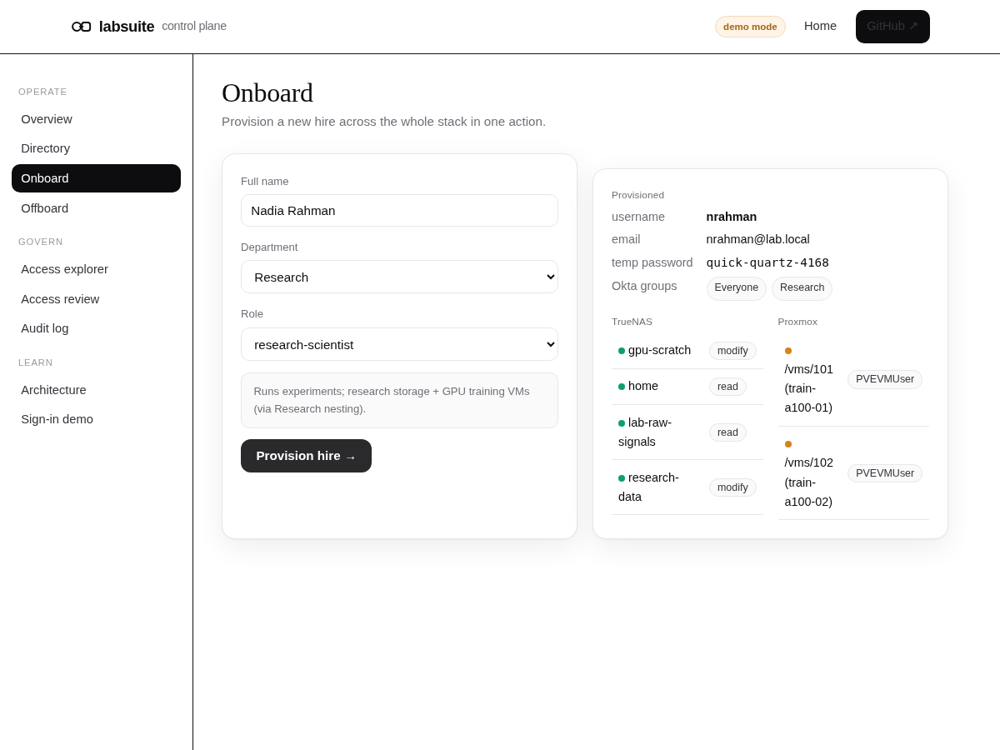
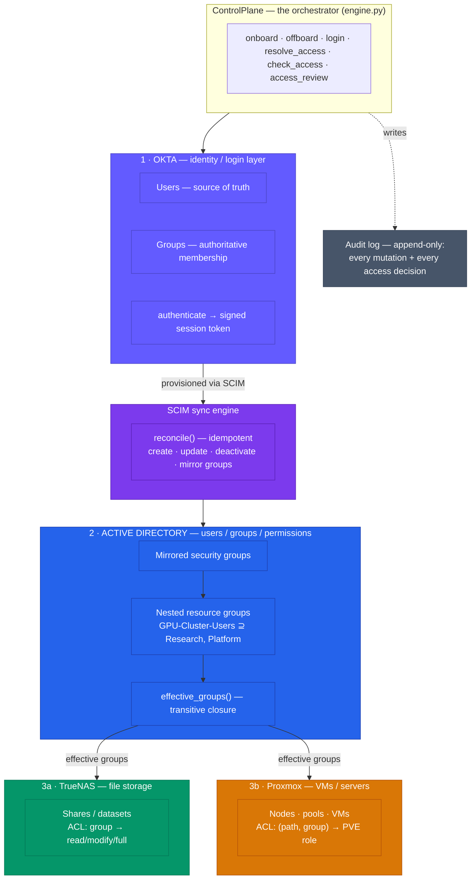
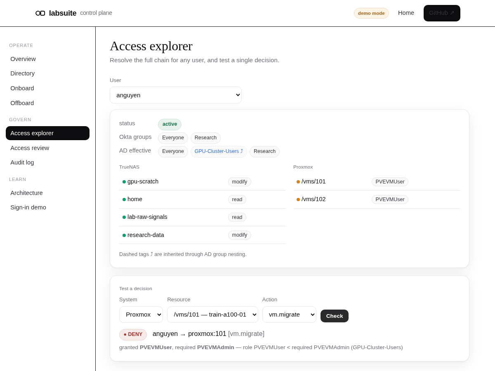
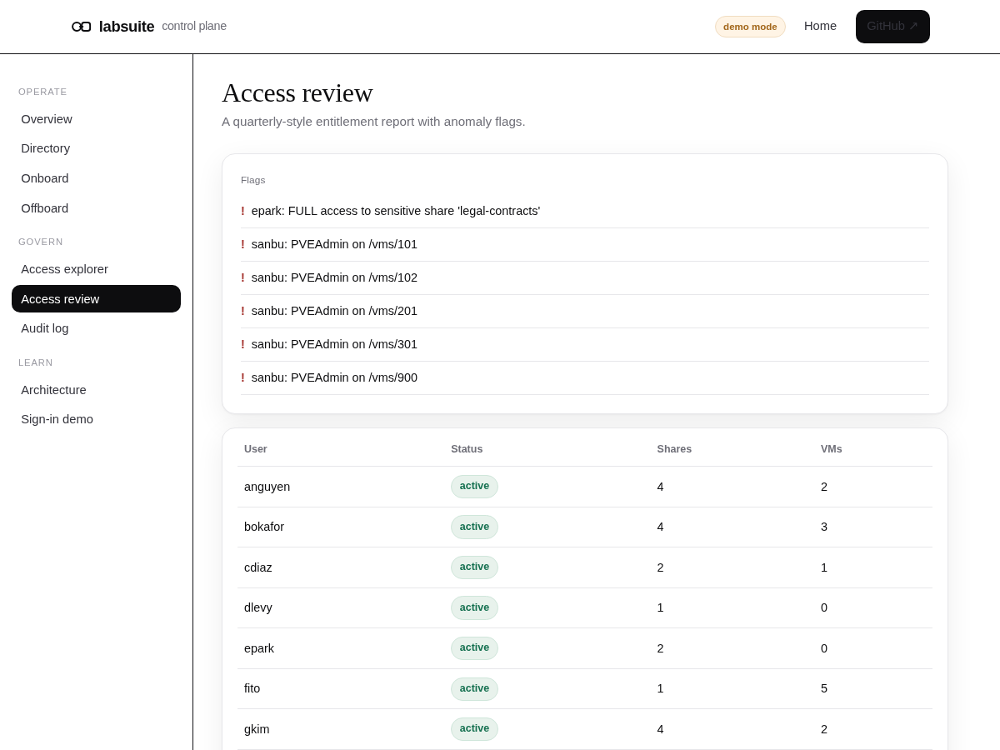
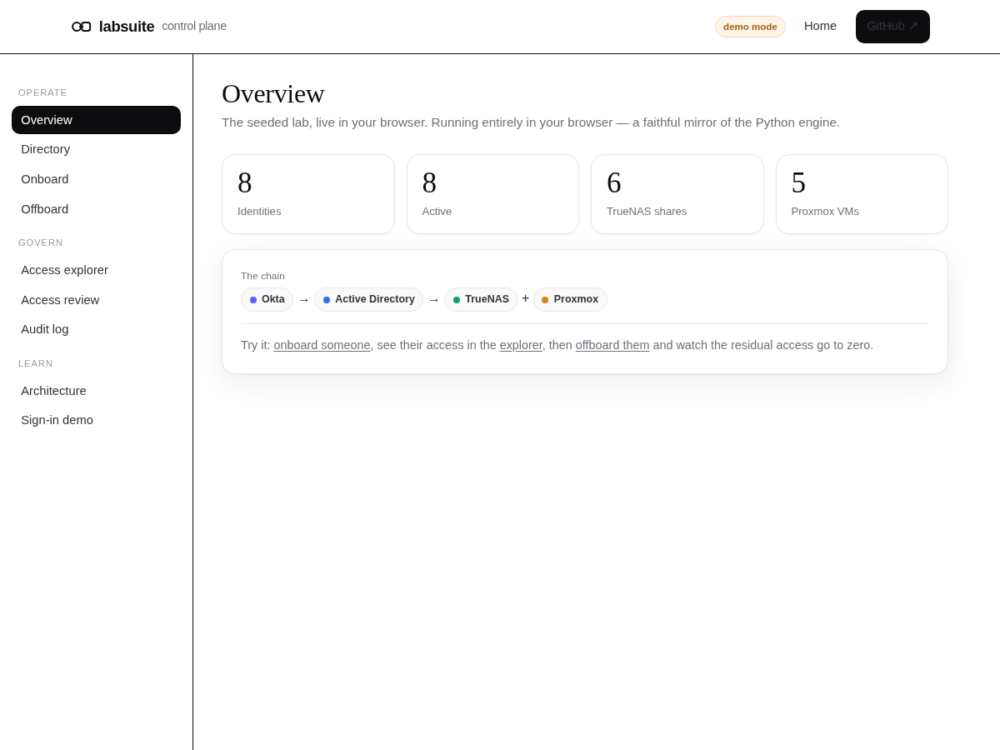

<div align="center">

# 🔐 LabSuite

**A from-scratch identity-to-infrastructure access-governance control plane — the lab's IT suite, wired the way a real one is: Okta → Active Directory → TrueNAS + Proxmox.**

*Author: Dr. Sanjay Anbu*

*Provision a hire across the whole stack in one call · deprovision same-day and prove it · resolve every allow/deny decision from identity down to storage and compute — all audited.*


[Live demo ↗](https://sanjaydoc.github.io/LabSuite/app/) · [Website ↗](https://sanjaydoc.github.io/LabSuite/) · [Architecture](#the-stack) · [Dashboard](#the-web-dashboard) · [Quickstart](#quickstart) · [How it maps to the real stack](#how-it-maps-to-the-real-stack)

</div>

<p align="center">
  
</p>
<p align="center"><sub><b>Onboard once, provisioned everywhere.</b> One action creates the hire in Okta, assigns policy groups, syncs to AD, and resolves their exact TrueNAS + Proxmox access — <a href="https://sanjaydoc.github.io/LabSuite/app/">try the live demo</a>.</sub></p>

---

## Why this exists

Every research lab runs on the same quiet machinery: an identity provider people
log into, a directory that decides what they can touch, and the storage and
compute that actually holds the work. When that chain is wired well, nobody
thinks about it. When it isn't, a departing employee keeps access for weeks, a
new hire waits two days for a share, and no one can answer *"who can read the
contracts folder?"* without a meeting.

**LabSuite is that chain, built from scratch and made operable.** It models one
specific, extremely common stack —

> **Okta** (identity / login) → **Active Directory** (users / groups / permissions) → **TrueNAS** (file storage) + **Proxmox** (VMs / servers)

— and exposes the *operations* an IT owner actually performs: onboard, offboard,
sync, resolve access, decide a single allow/deny, run an access review. Every
step is audited.

The core is **pure-Python and dependency-free** — it runs anywhere, in CI, with
no cloud and no external services — and every layer sits behind a **swappable
adapter** so the in-memory reference can be replaced with the real Okta / AD /
TrueNAS / Proxmox APIs without touching the control plane.

> **What this is, honestly:** a faithful **reference implementation / simulator**
> of the stack and the processes around it, not a wrapper over a live tenant. It
> exists to demonstrate the identity→infrastructure *logic* end-to-end — and to
> be the exact shape you'd fill in with real API calls. See
> [How it maps to the real stack](#how-it-maps-to-the-real-stack).

## The stack



**Read it two ways.** *Downward* is provisioning: a hire is created in Okta →
SCIM pushes them into AD → their group membership decides their ACLs on TrueNAS
and Proxmox. *Upward* is a decision: "can she start VM 101?" resolves her
**effective AD groups** (following nesting) → checks the Proxmox ACL on that VM's
path → allow/deny, written to the audit log. TrueNAS and Proxmox never see Okta —
they only ask AD for effective groups, exactly as the real systems are wired.

## The web dashboard

A polished, **zero-build web GUI** (vanilla HTML/CSS/JS — no framework) ships with
the project. Run `labsuite serve` for the live, API-backed version, or open the
[**live demo**](https://sanjaydoc.github.io/LabSuite/app/) — it runs entirely in
your browser as a faithful mirror of the Python engine, so you can click through
onboarding, access resolution, and reviews with nothing installed.

<table>
  <tr>
    <td width="50%"></td>
    <td width="50%"></td>
  </tr>
  <tr>
    <td align="center"><sub><b>Access explorer</b> — resolve Okta → AD (with nested groups ⤴) → TrueNAS + Proxmox, and test a single decision with its reason.</sub></td>
    <td align="center"><sub><b>Access review</b> — quarterly-style entitlements with flags for stale access, FULL on sensitive shares, and datacenter admin.</sub></td>
  </tr>
  <tr>
    <td width="50%"></td>
    <td width="50%"></td>
  </tr>
  <tr>
    <td align="center"><sub><b>Overview</b> — the seeded lab at a glance.</sub></td>
    <td align="center"><sub><b>Onboard</b> — the form and the resolved downstream access it produces.</sub></td>
  </tr>
</table>

## What makes it more than a toy

| | Typical script | **LabSuite** |
|---|---|---|
| Scope | One system | **The whole chain**, Okta → AD → TrueNAS + Proxmox, as one control plane |
| Sync | Fire-and-forget | **Idempotent SCIM reconcile** — second run is a provable no-op |
| Groups | Flat | **Nested AD groups** with transitive-closure resolution |
| Offboarding | "removed the account" | **Same-day deprovision that *verifies* zero residual access** |
| Decisions | Ad hoc | **Audited allow/deny** with the exact groups that granted it |
| Governance | — | **Quarterly access review** with anomaly flags (stale access, FULL on sensitive, datacenter admin) |
| Coupling | Hard-wired | **Swappable adapters** — drop in real Okta/AD/TrueNAS/Proxmox behind the same interface |
| Deps | Varies | **Zero** for the core; runs in CI on 3.10–3.12 |

## Quickstart

**Requires Python 3.10, 3.11, or 3.12.** The core has **zero third-party
dependencies**; the `.[api]` extra (FastAPI + Uvicorn) is only for the live HTTP
API and web GUI.

<details open>
<summary><b>macOS</b></summary>

```bash
git clone https://github.com/sanjaydoc/LabSuite.git
cd LabSuite

python3 -m venv .venv
source .venv/bin/activate
python -m pip install --upgrade pip
pip install -e ".[dev]"          # core + API + test tooling  (or just: pip install -e .)

labsuite demo                    # see the whole thing work end-to-end
```
</details>

<details>
<summary><b>Linux</b></summary>

```bash
git clone https://github.com/sanjaydoc/LabSuite.git
cd LabSuite

python3 -m venv .venv
source .venv/bin/activate
python -m pip install --upgrade pip
pip install -e ".[dev]"          # core + API + test tooling  (or just: pip install -e .)

labsuite demo
```
> If `python3 -m venv` fails, install the venv package first: `sudo apt install python3-venv`.
</details>

<details>
<summary><b>Windows</b> (PowerShell)</summary>

```powershell
git clone https://github.com/sanjaydoc/LabSuite.git
cd LabSuite

py -3.12 -m venv .venv
.\.venv\Scripts\Activate.ps1
python -m pip install --upgrade pip
python -m pip install -e ".[dev]"   # core + API + test tooling  (or just: -e .)

labsuite demo
```
> If PowerShell blocks the activate script, run once:
> `Set-ExecutionPolicy -Scope Process -ExecutionPolicy Bypass`.
> On `cmd.exe` instead of PowerShell, activate with `.\.venv\Scripts\activate.bat`.
</details>

Drive individual operations:

```bash
labsuite org                                        # the seeded lab
labsuite onboard --name "Nadia Rahman" --department Research --role research-scientist
labsuite access --user nrahman                      # everything she can touch
labsuite check --user nrahman --system proxmox --resource 101 --action vm.power
labsuite offboard --user nrahman                    # same-day, verified clean
labsuite review                                     # access review + flags
labsuite audit --tail 15                            # the audit trail
labsuite serve                                      # live FastAPI API + GUI (needs .[api])
```

Add `--state lab.json` to any command to persist the control plane between runs.

## What the demo shows

`labsuite demo` runs a scripted story and prints each step:

```
2. Onboard a new research scientist
   created nrahman (nrahman@lab.local), temp password bright-otter-6877
   Okta groups: Everyone, Research
   -> TrueNAS: {'research-data': 'modify', 'gpu-scratch': 'modify', 'lab-raw-signals': 'read', 'home': 'read'}
   -> Proxmox: {101: 'PVEVMUser', 102: 'PVEVMUser'}
   note: GPU access came from AD nesting (Research is nested in GPU-Cluster-Users), not a per-user grant.

4. Access decisions (resolved Okta -> AD -> resource)
   ALLOW    start her training VM       (role PVEVMUser via GPU-Cluster-Users)
   DENY     migrate it (needs admin)    (role PVEVMUser < required PVEVMAdmin)
   ALLOW    write research data         (granted via Research)
   DENY     read legal contracts        (no group grants sufficient access)

5. Offboard her -- same-day, verified
   deprovisioned across Okta + AD + downstream -> CLEAN: zero residual access
   re-login attempt: correctly rejected
```

The GPU access is the tell: nobody granted `nrahman` the GPU cluster directly —
she's in `Research`, and `Research` is **nested inside** `GPU-Cluster-Users` in
AD, so the entitlement is inherited and there is no per-user grant to forget to
revoke. That is the whole point of doing groups properly.

## Swappable by design

Every layer is reached through an abstract **provider interface** (`adapters/base.py`).
The control plane and the SCIM engine depend *only* on those interfaces:

```
IdentityProvider   ← OktaDirectory (in-memory)    →  OktaApiIdentityProvider   (real Okta REST API)
DirectoryProvider  ← ActiveDirectory (in-memory)  →  LdapDirectoryProvider     (real AD via LDAP)
StorageProvider    ← TrueNAS (in-memory)          →  TrueNasApiStorageProvider (real TrueNAS API)
ComputeProvider    ← Proxmox (in-memory)          →  ProxmoxApiComputeProvider (real PVE API)
```

The real-system skeletons live in [`adapters/live.py`](src/labsuite/adapters/live.py):
each method documents the exact API call / cmdlet it would make. Going live is
"fill in these bodies and construct `ControlPlane(okta=..., ad=..., ...)`" — no
change anywhere else.

## How it maps to the real stack

LabSuite is a reference implementation; here is where each simulated piece meets
reality, and where the boundaries are drawn honestly:

| LabSuite | Real system | Swap point |
|---|---|---|
| `OktaDirectory` HMAC session token | Okta OIDC / `/api/v1` + SCIM | `OktaApiIdentityProvider` |
| `ActiveDirectory` nested groups | AD security groups, `LDAP_MATCHING_RULE_IN_CHAIN` | `LdapDirectoryProvider` |
| `TrueNAS` share ACLs | TrueNAS `/api/v2.0` dataset ACLs (AD SIDs) | `TrueNasApiStorageProvider` |
| `Proxmox` path ACLs / roles | PVE `/api2/json/access/acl` | `ProxmoxApiComputeProvider` |

**Out of scope, on purpose:** endpoint management (laptop imaging / MDM — Jamf,
Intune, Autopilot), networking (VLANs, Wi-Fi), and SaaS-contract tracking.
LabSuite governs the **identity → infrastructure** half of onboarding; the
endpoint half is a separate pillar and is not simulated here.

## In production: PowerShell / Ansible / Terraform

LabSuite implements the *logic* of the chain in one place so it runs and tests
anywhere. In a real environment you drive the actual systems with the standard IT
toolkit — imperative **PowerShell** (AD/Okta), declarative **Ansible** (config
management), and **Terraform** (infrastructure-as-code). Every `labsuite` verb
maps to a concrete real command:

| Operation | Real-world equivalent |
|---|---|
| `labsuite onboard` | `New-ADUser` + `Add-ADGroupMember` · `microsoft.ad.user` · `okta_user` (Terraform) |
| `labsuite offboard` | `Disable-ADAccount` + strip memberships · Okta `/lifecycle/deactivate` |
| `ad.nest_group(...)` | `Add-ADGroupMember -Identity GPU-Cluster-Users -Members Research` |
| `truenas.grant(...)` | TrueNAS `filesystem.setacl` (REST / `midclt`) |
| `proxmox.grant(...)` | `pveum acl modify /pool/research --groups ... --roles PVEVMUser` |
| `labsuite review` | `Get-ADGroupMember -Recursive` report, scheduled |

**→ See [`docs/REAL_TOOLING.md`](docs/REAL_TOOLING.md)** for the full side-by-side
command reference for every operation.

## How it fits the "first IT hire" brief

| What the role asks for | Where it lives in LabSuite |
|---|---|
| **Own onboarding/offboarding end-to-end; deprovision same-day** | `ControlPlane.onboard` / `offboard` — the latter *verifies* zero residual access |
| **Inherit and document Okta → AD → TrueNAS + Proxmox, then operate it** | The entire project + [`docs/ARCHITECTURE.md`](docs/ARCHITECTURE.md) |
| **Scalable, auditable processes** | Append-only `AuditLog`; every mutation and decision recorded |
| **Okta admin: SSO, SCIM, group design** | `okta.py` + the idempotent `ScimSync` engine |
| **AD admin: group policy, permissions, nesting** | `active_directory.py` — nested groups + transitive resolution |
| **Baseline security hygiene; quarterly access reviews** | `ControlPlane.access_review` with anomaly flags |
| **Bias toward automation; document what you build** | One-command `onboard`/`offboard`; typed, tested, CI-green, documented |

## Project layout

```
labsuite/
├── src/labsuite/
│   ├── okta.py              # 1 · identity / login (source of truth, auth, SCIM source)
│   ├── active_directory.py  # 2 · users / groups / permissions (nested-group resolution)
│   ├── scim.py              #     the Okta -> AD sync engine (idempotent reconcile)
│   ├── truenas.py           # 3a · file storage (group-based share ACLs)
│   ├── proxmox.py           # 3b · VMs / servers (hierarchical path ACLs + roles)
│   ├── engine.py            # the ControlPlane — onboard/offboard/resolve/check/review
│   ├── policy.py            # role blueprints: who gets what by default
│   ├── audit.py             # append-only audit log
│   ├── crypto.py            # PBKDF2 passwords + HS256 session tokens (stdlib only)
│   ├── seed.py              # a realistic seeded lab, onboarded through the real path
│   ├── cli.py               # the `labsuite` command-line control plane
│   ├── api.py               # optional FastAPI: OIDC-ish + SCIM + admin + dashboard
│   └── adapters/            # base.py (interfaces) · live.py (real-system skeletons)
├── tests/                   # crypto · SCIM idempotency · nesting · access · e2e · API
├── docs/                    # ARCHITECTURE.md · website (index.html) · GUI (app/)
└── .github/workflows/       # CI (ruff + pytest on 3.10 / 3.11 / 3.12)
```

## License

Code: **MIT** (see [`LICENSE`](LICENSE)). This is an independent portfolio
project and is not affiliated with Okta, TrueNAS, Proxmox, or Microsoft.
